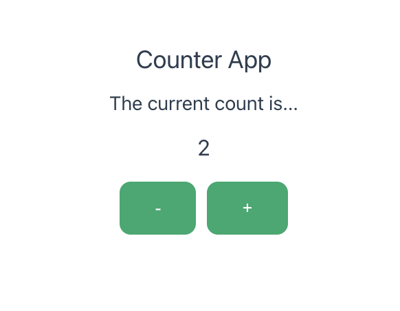
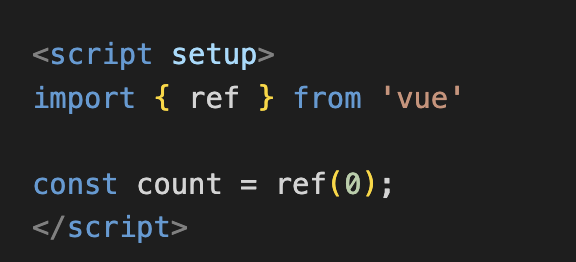

# counter-app

Built using create app with Vue. Followed along with Quick Start: https://vuejs.org/guide/quick-start

## Project Setup

```sh
npm install
```

### Compile and Hot-Reload for Development

```sh
npm run dev
```

___

## Quick Introduction

This is a quick project to build up confidence using vue 2 and vue 3. 

Starting with basic's, build a counter in vue. 

**Aim is to achieve the following:**

* Confidence in reading the Vue Documentation 
* Confidence in the terminology and structure of Vue/ CSS/ TypeScript
* Less reliance on Chat GPT, go back to overstack articles, understanding concept etc
* Build the application first and then watch a video tutorial if needed

Following along in Udemy: 

Learn to built frontend Vue 3 applications using Pinia, TypeScript, Supabase and the Composition API

**Instructor:** Laith Harb || Software Engineer

## Screenshots



Through the use of set up - composition api (vue 3).



import { ref } from 'vue': This line is importing the ref function from Vue. The ref function is used to create a reactive reference to a value.

const count = ref(0);: This line is declaring a constant variable count and initializing it with a reactive reference to the value 0. This means that count is a reactive state, and any changes to count will be automatically tracked and will cause the component to re-render.

## Additional Notes:

### Type Support for `.vue` Imports in TS

TypeScript cannot handle type information for `.vue` imports by default, so we replace the `tsc` CLI with `vue-tsc` for type checking. In editors, we need [Volar](https://marketplace.visualstudio.com/items?itemName=Vue.volar) to make the TypeScript language service aware of `.vue` types.

### Type-Check, Compile and Minify for Production

```sh
npm run build
```

### Lint with [ESLint](https://eslint.org/)

```sh
npm run lint
```
